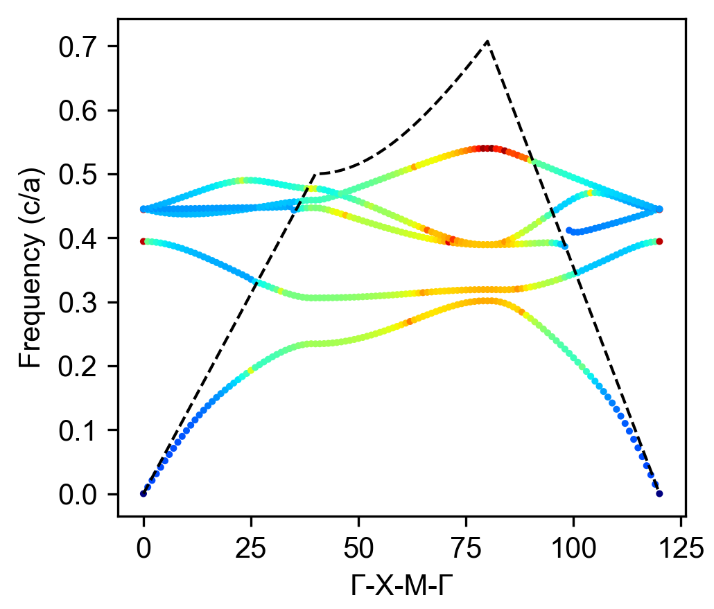

**功能介绍**

利用mph库链接COMSOL的java端口来实现多进程计算3D光子晶体平板能带/损耗。

外部环境依赖: COMSOL Multiphysics > 6.0 (含波动光学模块)

**环境搭建**

1. pip install -r requirement.txt

2. 安装COMSOL Multiphysics > 6.0 (含波动光学模块) https://cn.comsol.com/

**计算参数设置**

1. 在make_dataset.py设置合适几何参数

>   processor_num = 4  # 设置进程数
>
>  ComsolModel.r = 0.3 *295e-9  # 设置圆孔半径
>
>  ComsolModel.tk = 100e-9  # 设置PC厚度
>
>  a = 295e-9  # 设置晶格常数

2. 在clean_dataset.py中设置合适的筛选条件

>mask = ~((freq<4e-4) *(light_cone_reshape>0.0001))
>
>mask_hold = mask  # 记录未筛选前数据
>
>mask = mask *~((Qfactor<18) *(freq>light_cone_reshape))  # 光锥线以上
>
>mask = mask *~((Qfactor<50) *(freq>light_cone_reshape) *(freq<light_cone_reshape+0.02) *(freq>0.1))  # 光锥线附近
>
>\# mask = mask *~((freq>0.439375) *(freq<0.4394))  # 手动筛选
>
>\# mask += mask_hold *((freq>0.41215) *(freq<0.41220))  # 手动添加
>
>mask += mask_hold *((freq>4.27e-8) *(freq<4.274e-8))  # 手动添加
>
>mask += mask_hold *((freq>0.4116) *(freq<0.4117))  # 手动添加

3. 在check_field.py中设置k点id,模式id

>k_lp = 0  # k点id 0-121 (Gamma-X-M-Gamma)
>
>mode = 2  # 模式id 0-4

**源码运行**

python make_dataset

python clean_dataset

python check_field

**图A 能带**

**图B 波函数**

